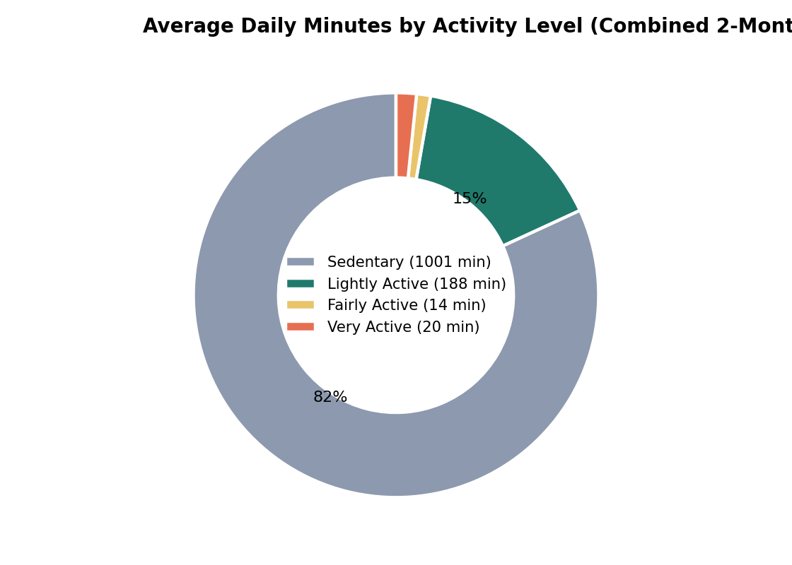
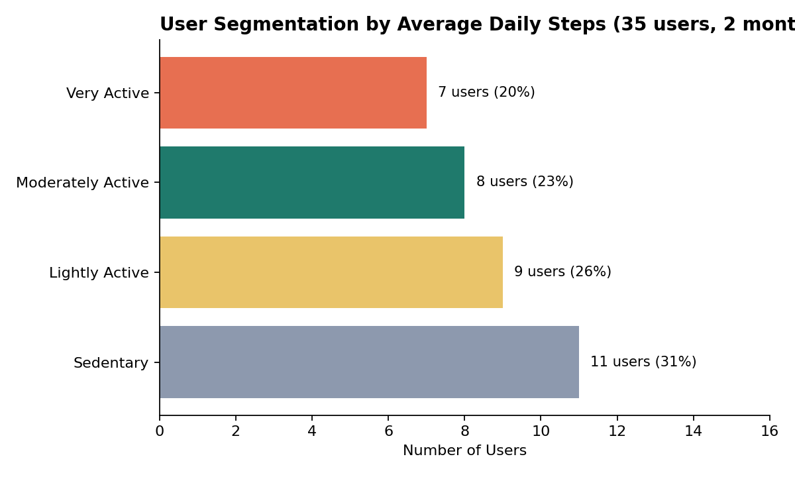
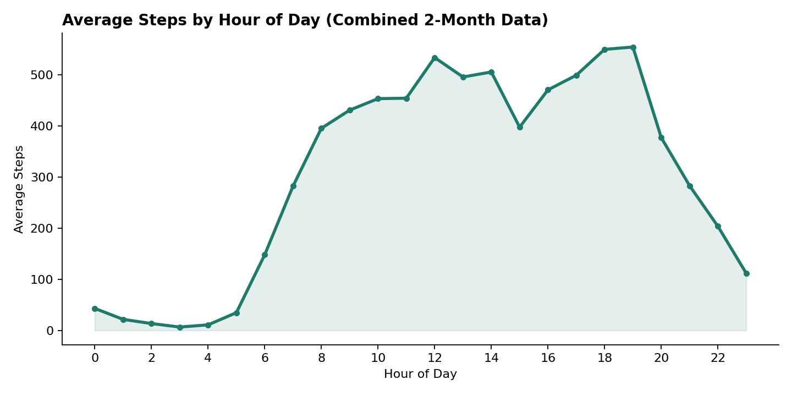
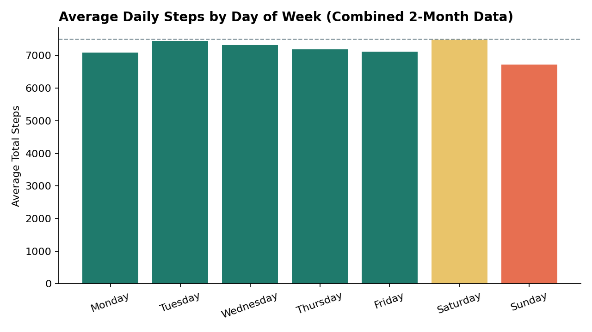
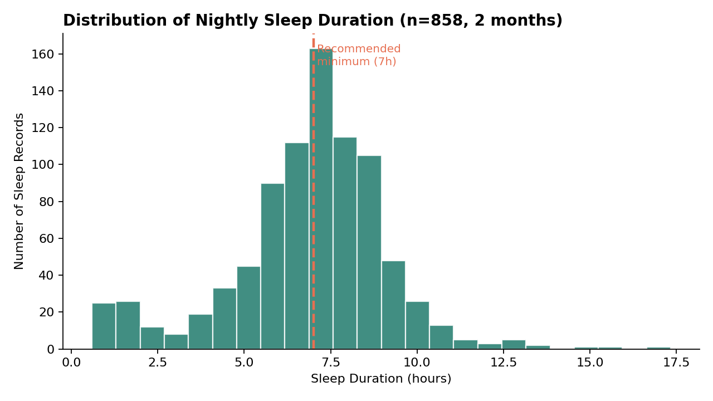
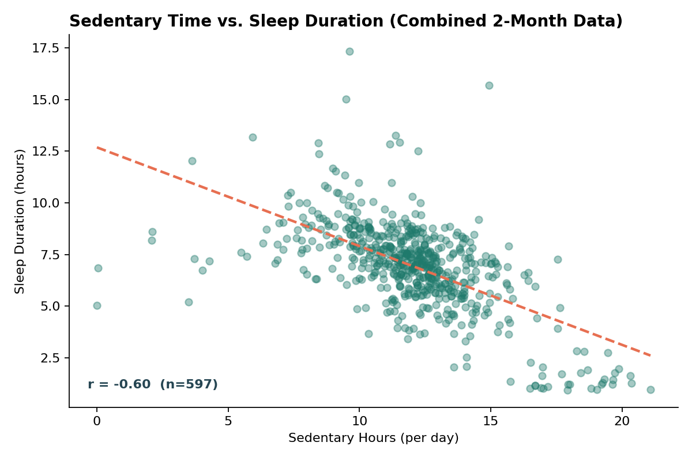
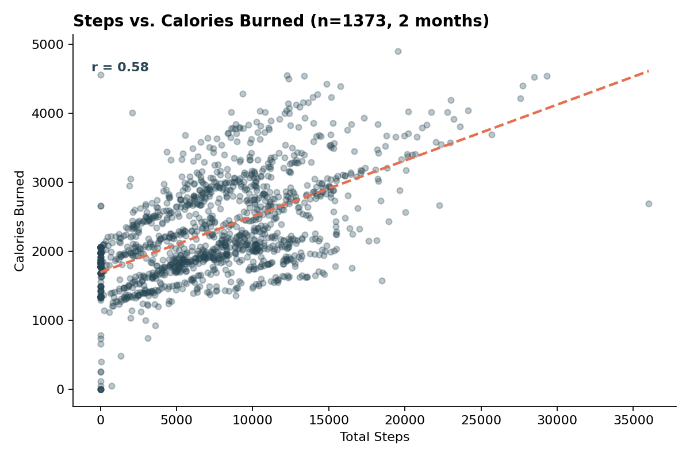
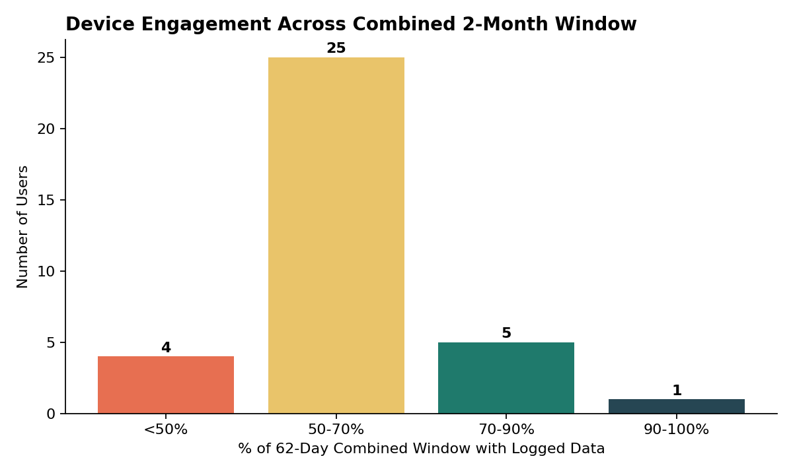

# How Can a Wellness Company Play It Smart?
### A Bellabeat Smart Device Usage Analysis
*Google Data Analytics Capstone Case Study — Rushil Negi*

---

## 1. Business Task

Bellabeat is a small but fast-growing manufacturer of health-focused smart devices for women (Leaf tracker, Time watch, Spring water bottle, and the Bellabeat app). Cofounder Urška Sršen believes that analyzing existing smart device fitness data — even from a *non-Bellabeat* device — can reveal usage trends that inform Bellabeat's marketing strategy.

**Guiding questions:**
1. What are some trends in smart device usage?
2. How could these trends apply to Bellabeat customers?
3. How could these trends help influence Bellabeat marketing strategy?

**Stakeholders:** Urška Sršen (Cofounder/CCO), Sando Mur (Cofounder), and the Bellabeat marketing analytics team.

This analysis focuses on the **Bellabeat Leaf and Time** trackers (activity + sleep tracking), since those map most directly onto the available dataset.

---

## 2. Data Source

**FitBit Fitness Tracker Data** (CC0: Public Domain), made available on Kaggle through Mobius — anonymized personal fitness tracker data from Fitbit users who consented to sharing minute-level output for physical activity, heart rate, and sleep.

This dataset spans **two adjacent collection windows** — March 12–April 12, 2016 and April 12–May 12, 2016 — released as separate file batches. Both were combined into a single analysis window after resolving a boundary-day conflict (see Process, step 4).

Files used in this analysis:

| File | Contents | Coverage |
|---|---|---|
| `dailyActivity_merged.csv` (Mar–Apr batch) | Daily steps, distance, activity minutes, calories | Mar 12 – Apr 11, 2016 |
| `dailySteps_merged.csv` + `dailyCalories_merged.csv` + `dailyIntensities_merged.csv` (Apr–May batch) | Same daily metrics, reconstructed from component files | Apr 12 – May 12, 2016 |
| `minuteSleep_merged.csv` (Mar–Apr batch) | Minute-level sleep state, aggregated to daily | Mar 11 – Apr 12, 2016 |
| `sleepDay_merged.csv` (Apr–May batch) | Official daily sleep summary | Apr 12 – May 12, 2016 |
| `hourlySteps_merged.csv` (both batches, combined) | Hourly step totals | Mar 12 – May 12, 2016 (full window) |
| `heartrate_seconds_merged.csv` (both batches, combined) | Second-level heart rate | Mar 29 – May 12, 2016 (full window; HR-capable devices only) |
| `weightLogInfo_merged.csv` (both batches, combined) | Manual/automatic weight logs | Mar 30 – May 12, 2016 (full window; sparse) |

**Combined date range (daily activity & sleep):** March 12 – May 12, 2016 (62 days), 35 unique users, 1,373 daily activity records, 858 daily sleep records.

*Heart rate and weight data still only cover the March–April window — the April–May originals for those two files were not part of this fix and remain outstanding.*

### Credibility check — does this data ROCCC?

| Criterion | Assessment |
|---|---|
| **Reliable** | Limited — only 35 users, below standard sample-size thresholds for population-level claims. |
| **Original** | Third-party (Mobius), not collected first-hand by Bellabeat or Fitbit. |
| **Comprehensive** | Partial — heart rate data covers only 15/35 users (43%); weight data covers only 11/35 users (31%), now confirmed across the full combined window, so those measures still cannot be generalized to the broader user base even though their coverage window is complete. |
| **Current** | Data is from 2016 — nearly a decade old. Device usage habits and smartphone/wearable behavior have changed materially since then. |
| **Cited** | Source and license are documented, but individual user demographics (age, location, occupation) are not provided. |

**Key limitation:** This is a small, dated, non-representative, gender-unspecified sample (Bellabeat's audience is exclusively women; this dataset doesn't confirm the gender of participants). Findings here should be treated as **directional hypotheses to validate**, not proof, ideally supplemented with Bellabeat's own first-party app/device data going forward.

---

## 3. Data Cleaning & Preparation (Process)

**Tools used:** Python (pandas, matplotlib) for cleaning, aggregation, and visualization.

Steps taken:
1. **Parsed dates/timestamps** — converted string dates (`3/25/2016`, `4/1/2016 7:54:00 AM`) to proper `datetime` objects for all files.
2. **Checked for duplicates** — none found within either raw file.
3. **Checked for non-wear / zero-activity days** — 133 of 1,373 combined daily records (9.7%) show 0 total steps, suggesting the device wasn't worn that day. These were kept but flagged rather than dropped, since they're informative about engagement (see Finding 5).
4. **Resolved a month-boundary conflict.** Both batches include April 12, 2016, but with conflicting values — the March–April file's April 12 is a partial, truncated day (step counts near zero, e.g. 224, 0, 24 — a device-sync cutoff), while the April–May file's April 12 is a complete day. The partial version was dropped and the complete version kept, giving one clean, non-duplicated 62-day window (March 12 – May 12) with zero duplicate Id+Date pairs.
5. **Validated the April–May daily activity reconstruction, then switched to the real file.** The original combined `dailyActivity_merged.csv` for April–May had been overwritten by a later upload sharing the same filename, so it was initially reconstructed from three surviving component files (`dailySteps_merged`, `dailyCalories_merged`, `dailyIntensities_merged`), merged on `Id` + date. Once the genuine file was recovered later in the project, it was cross-checked against the reconstruction on every column — **exact match, zero difference, on all 940 rows** — confirming the reconstruction had been fully correct all along. The script now uses the direct file when available, falling back to the (proven-accurate) reconstruction otherwise.
6. **Built a combined sleep table** from two different sources: the March–April month uses minute-level sleep logs (`minuteSleep_merged`, coded 1 = asleep, 2 = restless, 3 = awake) aggregated up to session-then-day level; the April–May month uses the official pre-aggregated `sleepDay_merged` file. On the one overlapping boundary night (April 12), the official file's version was kept over the manually-aggregated one, consistent with the general rule of preferring an official rollup over a manual reconstruction when both exist. Result: 858 daily sleep records, 25 unique users, zero duplicate keys.
7. **Merged** the combined daily activity table with the combined daily sleep table on `Id` + `Date` (597 of 1,373 activity-days had matching sleep data).
8. **Aggregated hourly step data** across the full combined window to look at intraday and day-of-week patterns. This required the same boundary-day fix as the daily activity data: the March–April file's April 12 was truncated (only hours 0–10 present, a device-sync cutoff matching the same pattern found in daily steps/calories), while the April–May file's April 12 was complete; the partial version was dropped and the complete one kept, giving a clean 46,008-row, 35-user, zero-duplicate combined hourly table.
9. **Combined heart rate and weight data across both months.** The March–April heart rate data showed the same device-sync truncation on April 12 as the other March–April files (last reading at 11:03 AM), resolved the same way — partial day dropped, complete version kept. The weight data had two exact duplicate log entries (matched by `LogId`, not just by date) shared between both source files on the boundary day, which were deduplicated before combining — result: 78 combined weight records across 11 users, and 3,614,915 combined heart rate readings across 15 users, both with zero duplicate keys.
10. **Computed user-level averages** (avg. steps, sedentary minutes, calories) across the full 62-day window to segment users by activity level, using the CDC's general step-count activity bands (<5,000 = Sedentary; 5,000–7,499 = Lightly Active; 7,500–9,999 = Moderately Active; 10,000+ = Very Active).
11. **Computed logging consistency** — the % of the 62-day combined window each user actually generated data for, as a proxy for device engagement. Note this is a stricter bar than a single-month analysis: a user who logged perfectly for one full month but wasn't part of the other month's export will show as roughly 50%, not as "inconsistent" in the everyday sense — this is called out explicitly in Finding 8 below.

Full reproducible code: [`scripts/analysis_combined.py`](../../scripts/analysis_combined.py).

---

## 4. Analysis & Key Findings

### Finding 1 — Users are sedentary for the majority of their tracked day
On average, across the full 62-day, 35-user window, users logged **~1,001 minutes (16.7 hours) of sedentary time per day**, versus only ~188 minutes lightly active, ~14 minutes fairly active, and ~20 minutes very active.

### Finding 2 — Users segment into four fairly even activity tiers
Segmenting the 35 users by their average daily steps across the full two-month window shows a fairly even spread — no single "typical" user:

- **Sedentary** (<5,000 steps/day): 11 users (31%)
- **Lightly Active** (5,000–7,499): 9 users (26%)
- **Moderately Active** (7,500–9,999): 8 users (23%)
- **Very Active** (10,000+): 7 users (20%)

This matters for Bellabeat: a one-size-fits-all marketing message won't land — messaging and in-app coaching should adapt to where a user currently sits.

### Finding 3 — Clear intraday activity peak in the early evening
Averaged across the full 62-day, 35-user combined window, steps climb steadily through the day and peak sharply at **7 PM** (avg. 555 steps in that hour), with a broad elevated plateau from late morning through early evening and a trough overnight.

### Finding 4 — Saturday and Tuesday are the most active days; Sunday is the least active

Sunday activity is meaningfully lower than the rest of the week — a natural moment for a wellness brand to nudge users toward light movement or recovery-focused content instead of pure step-count pressure. This pattern is now confirmed on the full combined window, not just a single month's data.

### Finding 5 — Sleep is a bigger opportunity than steps
Of the 858 combined daily sleep records (March–May, 25 users):
- Average **sleep efficiency** (time asleep ÷ time in bed) was **92.0%** — actual sleep quality once in bed is fine.
- But **45.8% of nights logged under 7 hours of total sleep** — the generally recommended minimum for adults.
- Median sleep duration was **7.1 hours** — right at that threshold, meaning a substantial share of users are falling short even though the "typical" user is roughly on target.

### Finding 6 — More sedentary daytime minutes is associated with *less* sleep, not more
Across 597 matched activity+sleep days, there's a moderate negative correlation (**r ≈ -0.60**) between a user's daily sedentary minutes and their total sleep that night — days with more sitting/inactivity tend to precede shorter sleep, not longer "resting" sleep as might be assumed. This held consistent (r was -0.56 to -0.67 across the single-month cuts of this data), reinforcing that it's a real pattern rather than a one-month fluke.

*(Correlation, not causation — this dataset can't tell us why, but it's a compelling pattern for a wellness brand to explore further, e.g., stress, screen time, or lack of a wind-down routine.)*

### Finding 7 — Steps and calories are only moderately correlated (r ≈ 0.58)
Across all 1,373 combined daily records, calorie burn is driven by more than step count alone (e.g., intensity, resting metabolic rate) — a reminder that step-count-only messaging undersells the fuller picture of a workout or active day.

### Finding 8 — Logging consistency reflects two overlapping cohorts, not one steady pattern
Across the full 62-day combined window, only 1 of 35 users logged 90–100% of possible days — but that's expected, since the two source files came from two mostly-back-to-back exports and not every user appears in both. The more informative cut: **25 of 35 users (71%) logged data in the 50–70% range**, consistent with a user who was fully present for roughly one of the two ~31-day collection windows. A smaller group — **4 users (11%)** — logged on fewer than half the combined days, which is the more meaningful "genuinely inconsistent" signal here.

*(This bucketing looks different from a single-month analysis by design — see Process, step 10, for why a straight % of the 62-day window isn't quite the same thing as "inconsistent logging" for users who only participated in one export.)*

### Finding 9 — Advanced metrics (heart rate, weight) have much lower adoption
Now confirmed across the full combined window: **15 of 35 users (43%)** have any heart rate data, and only **11 of 35 (31%)** logged weight — versus near-universal basic step/activity logging. This points to a steep drop-off in engagement as tracking becomes more effortful (manual weight entry) or is only available on higher-tier hardware (continuous HR). Weight logging is especially sparse per-user too: 11 users produced just 78 entries combined across the full 62-day window — an average of roughly one log every 9 days per user who logs at all, far from daily tracking.

---

## 5. Recommendations for Bellabeat Marketing Strategy

Applying these trends to Bellabeat's **Leaf and Time** trackers and the Bellabeat app:

1. **Lead with sleep, not just steps.** With 46% of nights falling short of 7 hours, Bellabeat is well-positioned (its app already tracks sleep, stress, and mindfulness) to market itself as a *sleep-first* wellness brand — a different competitive lane than the step-count gamification larger fitness-first competitors lean on.

2. **Time push notifications to real behavior windows.** Use the sharp 7 PM activity peak to prompt short movement challenges or hydration reminders (tying into the Spring bottle) when users are already naturally active. Shift Sunday messaging toward recovery, mindfulness, or gentle-movement content instead of activity-goal pressure — the low-Sunday pattern is now confirmed on the full combined window, not just a single month.

3. **Segment onboarding and coaching by activity tier.** Since users split roughly evenly across four activity bands, a single default daily step goal will underserve most users. Adaptive goal-setting — anchored to a user's own baseline instead of a fixed 10,000-step target — is likely to feel more attainable and retain Sedentary/Lightly Active users, who are most at risk of disengaging.

4. **Build a "sedentary → sleep" story into the product.** The link between high sedentary time and shorter sleep is a natural content and feature hook — e.g., an evening wind-down prompt for users who've logged a high-sedentary day, positioning Bellabeat membership's guidance as directly responsive to the user's own data. This pattern held up consistently across two separate monthly cuts of the data — a meaningfully stronger basis for a recommendation than a single month alone would give.

5. **Invest in re-engagement flows for lapsed loggers.** The 11% of users logging on fewer than half the combined 62-day window — and the steep drop-off in heart rate/weight logging — suggest engagement, not device capability, is the binding constraint for a meaningful subset of users. Lightweight, low-effort logging prompts may do more for retention than new hardware features would.

---

## 6. Limitations & Next Steps

- This is a **small (35-user), 2016-era, gender-unconfirmed** sample from a competitor's product, not Bellabeat's own data — treat findings as hypotheses to test, not final conclusions.
- **All data sources are now confirmed across the full combined 62-day window** — the heart rate and weight gap flagged in earlier drafts of this report has been resolved; both were re-supplied, checked for the same boundary-day issues found elsewhere in this dataset (a truncated final day in the heart rate file, two duplicate log entries in the weight file), and cleanly merged.
- Heart rate and weight data are too sparse even within their single-month coverage to draw reliable conclusions; worth a follow-up analysis on Bellabeat's own first-party data (Leaf/Time users), where sample size and demographic fit would be far stronger.
- The two source files overlapped on one calendar day (April 12) with conflicting values, resolved by keeping the more complete record and discarding the truncated one (documented in Process, step 4) — a reasonable judgment call, but worth being transparent about if this case study is reviewed closely.
- A logical next step would be an A/B test of adaptive vs. fixed step goals, or a cohort analysis of push-notification timing, directly within the Bellabeat app.

---

*Data: [FitBit Fitness Tracker Data](https://www.kaggle.com/datasets/arashnic/fitbit), CC0: Public Domain, via Mobius. Analysis and visualizations by Rushil Negi, built for the Google Data Analytics Certificate capstone.*
