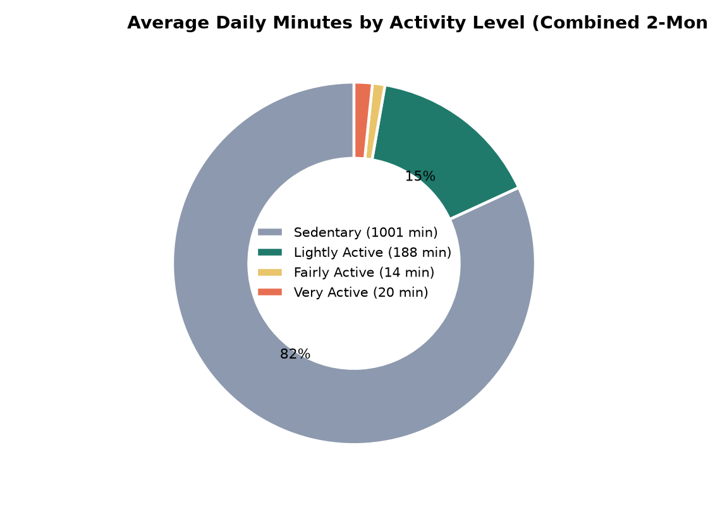
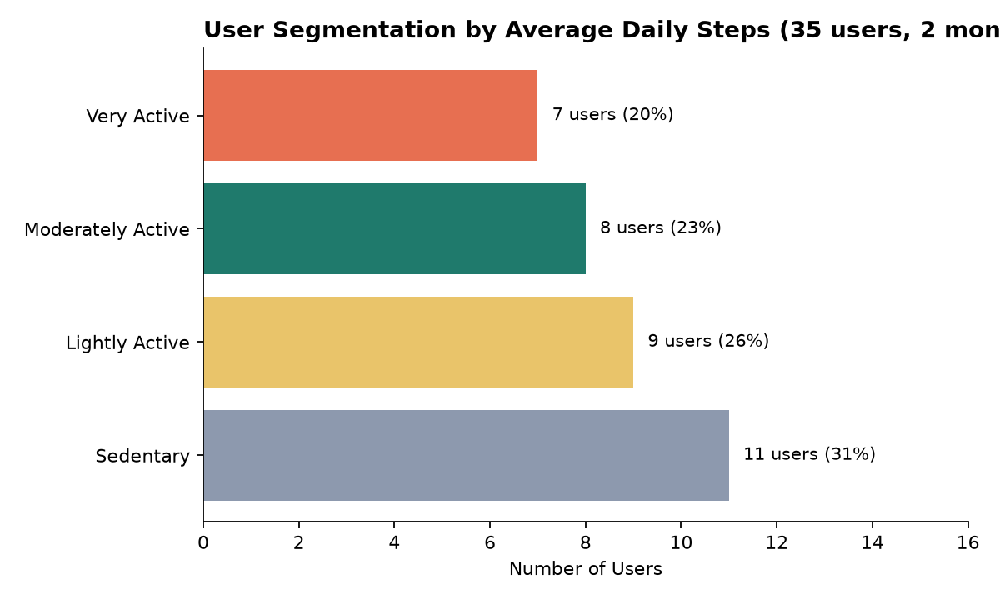
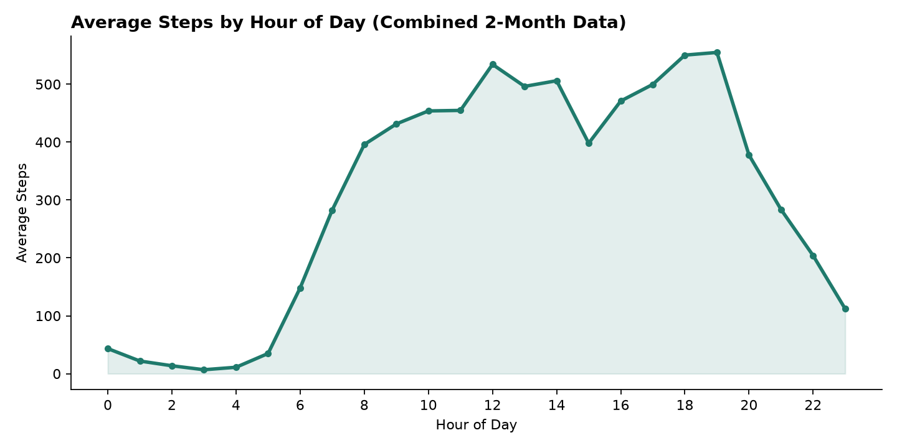
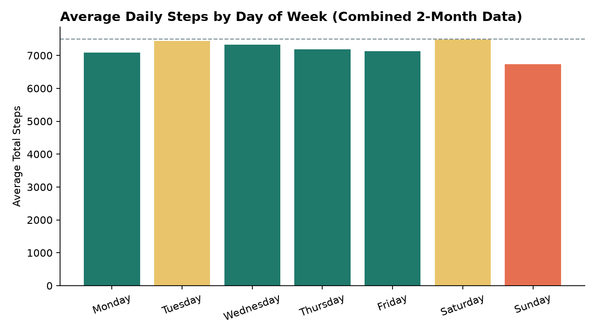
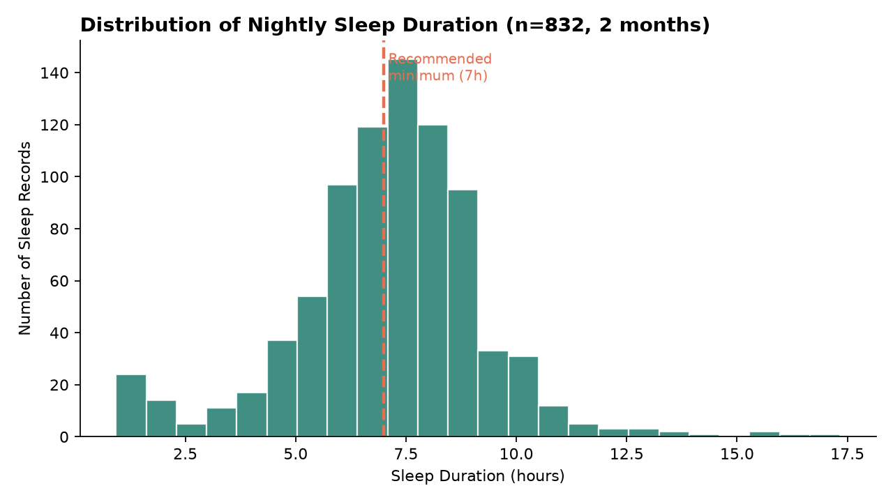
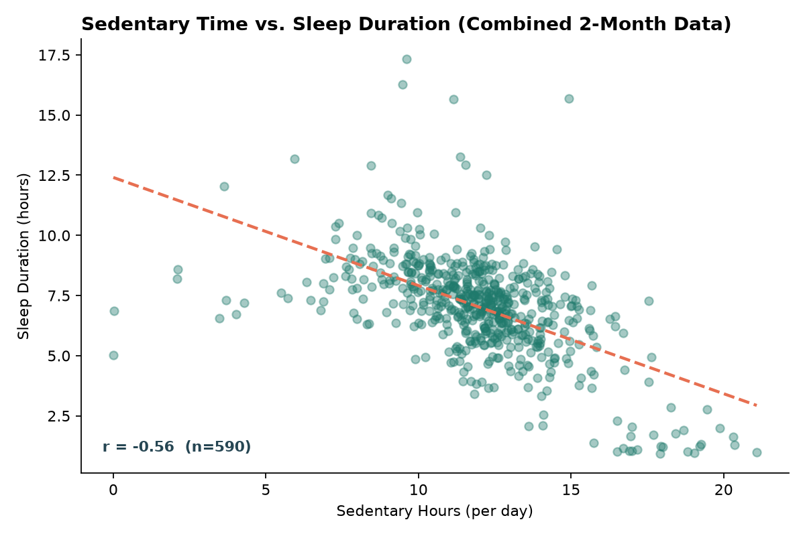
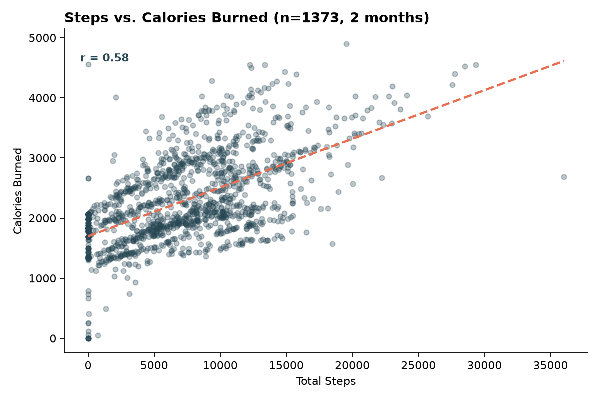
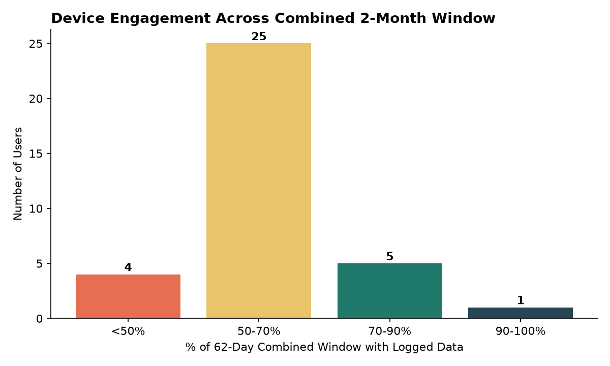

# How Can a Wellness Company Play It Smart?
### A Bellabeat Smart Device Usage Analysis
*Google Data Analytics Capstone Case Study, Rushil Negi*

---

## 1. Business Task

Bellabeat is a small but growing company that makes health-focused smart devices for women. Its products are the Leaf tracker, the Time watch, the Spring water bottle and the Bellabeat app. Cofounder Urška Sršen believes that smart device fitness data, even from a non-Bellabeat device, can show usage trends that help shape the marketing strategy.

Guiding questions:
1. What are some trends in smart device usage?
2. How could these trends apply to Bellabeat customers?
3. How could these trends help influence Bellabeat marketing strategy?

Stakeholders: Urška Sršen (Cofounder and CCO), Sando Mur (Cofounder) and the Bellabeat marketing analytics team.

This analysis focuses on the Leaf and Time trackers, as activity and sleep tracking are what the dataset covers best.

---

## 2. Data Source

The data is the FitBit Fitness Tracker Data (CC0: Public Domain), made available on Kaggle through Mobius. It contains anonymised fitness tracker data from Fitbit users who agreed to share minute-level output for physical activity, heart rate and sleep.

The dataset comes as two exports, March 12 to April 12, 2016 and April 12 to May 12, 2016. Both were combined into one analysis window once the April 12 conflict was resolved (see Process, step 4).

| File | Contents | Coverage |
|---|---|---|
| `dailyActivity_merged.csv` (Mar–Apr) | Daily steps, distance, activity minutes, calories | Mar 12 – Apr 11, 2016 |
| `dailySteps`, `dailyCalories`, `dailyIntensities` (Apr–May) | Same daily metrics, rebuilt from three files | Apr 12 – May 12, 2016 |
| `minuteSleep_merged.csv` (Mar–Apr) | Minute-level sleep state, grouped into days | Mar 11 – Apr 12, 2016 |
| `sleepDay_merged.csv` (Apr–May) | Official daily sleep summary | Apr 12 – May 12, 2016 |
| `hourlySteps_merged.csv` (both) | Hourly step totals | Mar 12 – May 12, 2016 |
| `heartrate_seconds_merged.csv` (both) | Second-level heart rate | Mar 29 – May 12, 2016 |
| `weightLogInfo_merged.csv` (both) | Manual and automatic weight logs | Mar 30 – May 12, 2016 |

Combined daily activity and sleep covers March 12 to May 12, 2016 (62 days) with 35 users, 1,373 daily activity records and 832 daily sleep records.

### Does this data ROCCC?

| Criterion | Assessment |
|---|---|
| Reliable | Limited. Only 35 users, which is below the usual sample size for population-level claims. |
| Original | Third party (Mobius). Not collected by Bellabeat or Fitbit. |
| Comprehensive | Partial. Heart rate covers 15 of 35 users (43%) and weight covers 11 of 35 (31%), so neither can be generalised. |
| Current | The data is from 2016. Wearable habits have changed a lot since then. |
| Cited | The source and licence are documented, but there are no demographics (age, location, occupation). |

The sample is small, old and not representative, and the dataset does not confirm the gender of participants even though Bellabeat sells to women. The findings below are directions worth testing, not proof. Bellabeat's own app and device data would be the next thing to check them against.

---

## 3. Data Cleaning and Preparation (Process)

Tools used: Python (pandas, matplotlib) for cleaning, aggregation and charts.

1. Parsed dates and timestamps into datetime format for all files.
2. Checked for duplicates within each raw file. None were found.
3. Checked for non-wear days. 133 of 1,373 daily records (9.7%) show 0 steps, which suggests the device was not worn. These were kept and flagged, as they say something about engagement (see Finding 8).
4. Resolved the April 12 conflict. Both exports include April 12 with different values. The March–April version stops part way through the day (step counts of 224, 0 and 24, which looks like a device sync cutoff) and the April–May version is complete. I dropped the partial version. This left one 62-day window with no duplicate Id and date pairs.
5. Rebuilt and then checked the April–May daily activity file. The original `dailyActivity_merged.csv` was overwritten by a later file with the same name, so I rebuilt it from `dailySteps`, `dailyCalories` and `dailyIntensities`. The real file was recovered later and compared with the rebuild. All 940 rows matched on every column the rebuild contains. The three distance columns cannot be rebuilt and are empty in the fallback. The script uses the real file when it is there.
6. Built a combined sleep table. March–April only has minute-level logs (1 = asleep, 2 = restless, 3 = awake), so these were grouped into sleep sessions and then into days. Each session is dated by the day it ended, so a night that crosses midnight counts once. April–May has the official `sleepDay_merged` file. For April 12 the official version was kept. Both sources use a 60-minute minimum time in bed to remove naps. The result is 832 daily sleep records from 25 users.
7. Merged activity and sleep on Id and date. 590 of 1,373 activity days have a matching sleep record. Because sleep is dated by the day it ended, that is the night before the activity day.
8. Aggregated hourly steps for the full window. The March–April file has the same April 12 cutoff (only hours 0 to 10 are present), so the same fix was used. The final table has 46,008 rows, 35 users and no duplicates.
9. Combined heart rate and weight. The March–April heart rate data is cut off on April 12 (last reading 11:03 AM), so that day was dropped. The weight files share two duplicate entries on the boundary day, which were removed by `LogId`. This gave 78 weight records from 11 users and 3,614,915 heart rate readings from 15 users.
10. Calculated user averages (steps, sedentary minutes, calories) over the full window and grouped users with the CDC step bands: under 5,000 Sedentary, 5,000 to 7,499 Lightly Active, 7,500 to 9,999 Moderately Active and 10,000 or more Very Active.
11. Calculated logging consistency as the share of the 62 days each user has data for. This is a harsher measure than a single month. A user who logged every day of one export but is not in the other will show as about 50%. See Finding 8.

Code: [`scripts/analysis_combined.py`](../../scripts/analysis_combined.py)

---

## 4. Analysis and Key Findings

### Finding 1: Users are sedentary for most of the day
Over the 62 days and 35 users, the average was about 1,001 minutes (16.7 hours) of sedentary time a day. That compares with about 188 minutes lightly active, 14 fairly active and 20 very active.

### Finding 2: Users split fairly evenly across four activity tiers
Grouping the 35 users by average daily steps:
- Sedentary (under 5,000): 11 users (31%)
- Lightly Active (5,000 to 7,499): 9 users (26%)
- Moderately Active (7,500 to 9,999): 8 users (23%)
- Very Active (10,000 or more): 7 users (20%)

There is no single typical user, so one marketing message will not suit everyone.

### Finding 3: Activity peaks in the early evening
Steps rise through the day and peak at 7 PM (555 steps on average in that hour). There is a wide plateau from late morning to early evening and a low overnight.

### Finding 4: Day of week is not a stable pattern
Over the full window, Saturday (7,485 steps) and Tuesday (7,443) are the most active days and Sunday is the least active (6,727). Monday to Friday sit between 7,094 and 7,334, so Sunday is the only clear outlier. Month 1 on its own had Wednesday and Thursday on top, so the busiest days change between months, although Sunday is the lowest in both. The March panel was also still filling up, so the combined result leans on April and May. I would treat the weekday pattern as loose.

### Finding 5: About 44% of nights are under 7 hours
Across 832 sleep records from 25 users:
- Average sleep efficiency (time asleep divided by time in bed) was 92.1%. Sleep quality once in bed is fine.
- 43.9% of nights were under 7 hours, the usual minimum for adults. The share is the same in each month on its own (43.8% in March–April and 43.9% in April–May).
- Median sleep was 7.25 hours, so the typical user is just over the line while a large share fall short.

### Finding 6: More sedentary time goes with less sleep
Across 590 matched days the correlation between sedentary minutes and total sleep is r = -0.56. Days with more sitting are linked to shorter sleep on the night before. Each month gives the same result on its own (r = -0.56 in March–April, n = 180, and in April–May, n = 410). This is correlation only. The data cannot say why, or which way round it works.

### Finding 7: Steps and calories are only moderately correlated (r = 0.58)
Calorie burn depends on more than steps, such as intensity and resting metabolic rate. Messaging built only around step count leaves out part of an active day.

### Finding 8: Logging consistency reflects two overlapping groups
Only 1 of 35 users logged on 90 to 100% of the 62 days. This is expected, as the data comes from two back-to-back exports and not every user is in both. 25 of 35 users (71%) logged on 50 to 70% of days, which fits a user who was present for one of the two months. 4 users (11%) logged on fewer than half the days. Users who are only in one export show as about 50% by construction, so these buckets measure panel membership as much as engagement.

### Finding 9: Heart rate and weight have much lower adoption
15 of 35 users (43%) have any heart rate data and 11 of 35 (31%) logged weight. Basic step tracking is close to universal. Heart rate needs higher-end hardware and weight needs manual entry. The 11 weight users made 78 entries over 62 days, around one entry every 9 days each.

---

## 5. Recommendations for Bellabeat Marketing Strategy

These apply to the Leaf and Time trackers and the Bellabeat app.

1. Lead with sleep as well as steps. About 44% of nights fall short of 7 hours and the app already tracks sleep, stress and mindfulness. A sleep-first position is a different lane from the step-count competition between larger fitness brands.
2. Time notifications around the 7 PM peak. Short movement challenges or hydration reminders (linked to the Spring bottle) fit when users are already active. Because the day-of-week pattern is not stable, test any weekday-specific messaging before relying on it.
3. Set goals by activity tier. Users are spread across all four bands, so one default step goal will not suit most of them. A goal based on each user's own baseline is more attainable than a fixed 10,000 steps, and should help keep Sedentary and Lightly Active users.
4. Build the sedentary and sleep link into the product. An evening wind-down prompt after a high-sedentary day would use the user's own data. The link held in both single-month cuts, which is a better basis than one month alone.
5. Add re-engagement prompts for users who stop wearing the device. Month 1 found 7 of 35 users with zero steps on more than a quarter of their enrolled days. Low-effort logging prompts may help retention more than new hardware features.

---

## 6. Limitations and Next Steps

- This is a small (35 users), 2016, gender-unconfirmed sample from a competitor's product. It is not Bellabeat data, so the findings are hypotheses to test.
- April 12 appeared in both exports with different values. I kept the complete record and dropped the truncated one. This was a judgement call and is documented in Process, step 4.
- The two sleep sources are built differently (minute logs for March–April, the official summary for April–May). They now use the same date rule and minimum time in bed, but small differences between them are possible.
- Heart rate and weight are too sparse for reliable conclusions. Bellabeat's own Leaf and Time data would be a better test.
- A next step would be an A/B test of adaptive and fixed step goals, or a test of notification timing, inside the Bellabeat app.

### Conclusion
Users spend most of the day sedentary, fall into four fairly even activity tiers and are most active around 7 PM. Sleep and sedentary time give the most consistent findings. About 44% of nights are under 7 hours and shorter sleep goes with more sedentary time, and both results are the same in each month of data. Bellabeat should build its marketing around sleep and adaptive goals and test the other findings on its own users.

---

*Data: [FitBit Fitness Tracker Data](https://www.kaggle.com/datasets/arashnic/fitbit), CC0: Public Domain, via Mobius. Analysis and charts by Rushil Negi for the Google Data Analytics Certificate capstone.*
