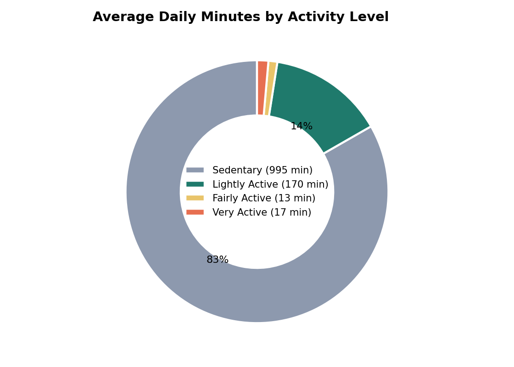
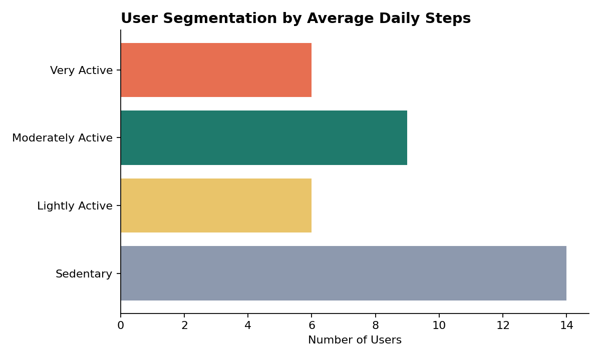
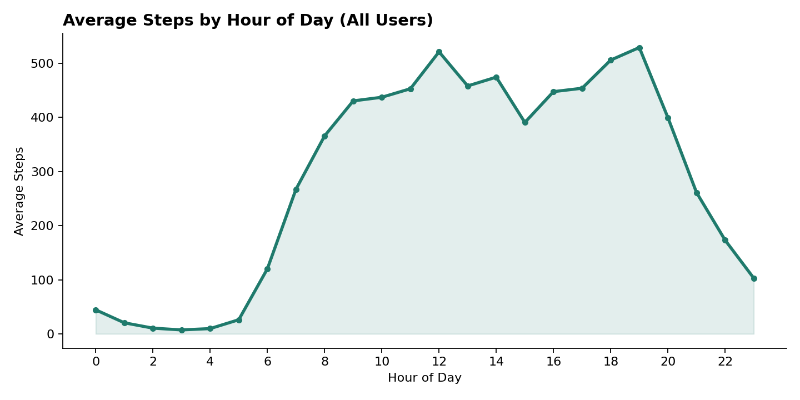
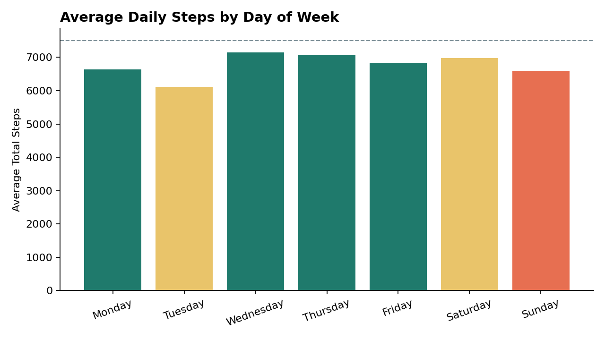
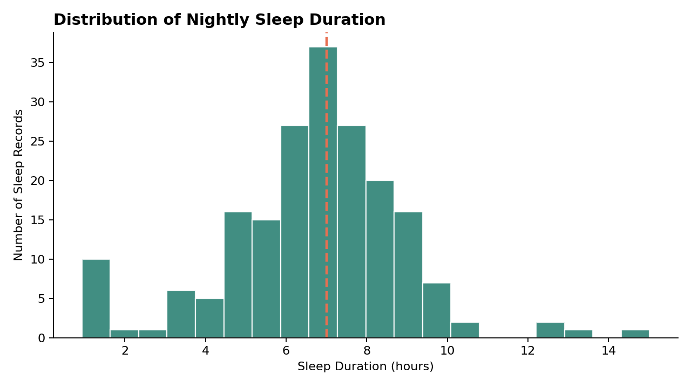
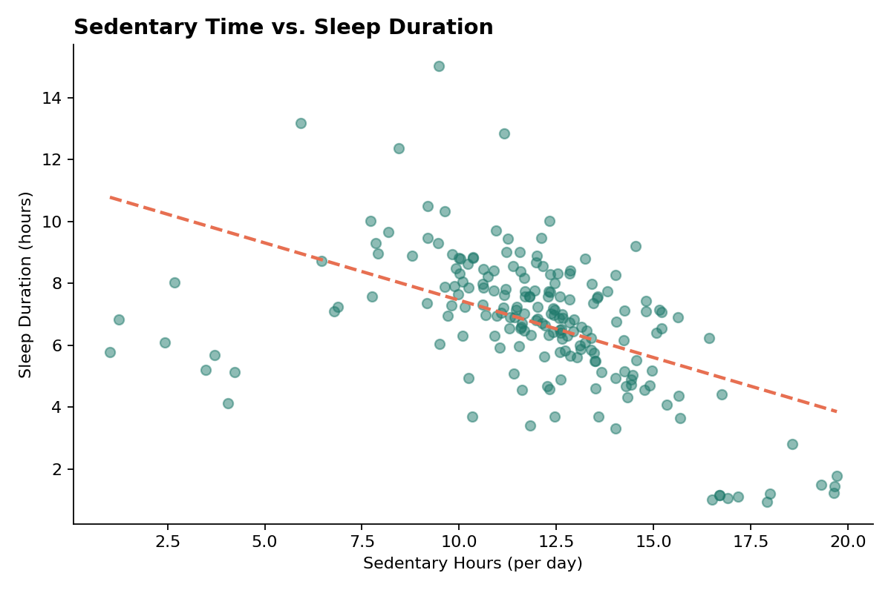
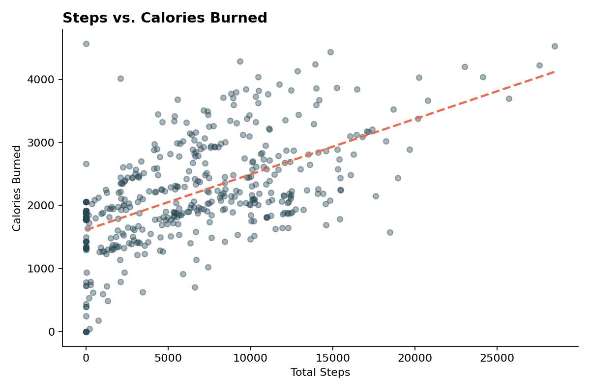
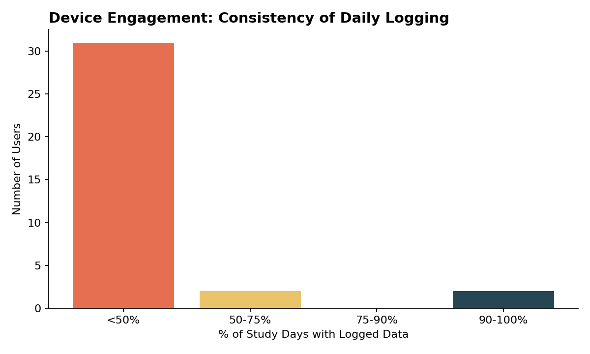

# How Can a Wellness Company Play It Smart?
### A Bellabeat Smart Device Usage Analysis — Month 1 (March 12 – April 12, 2016)
*Google Data Analytics Capstone Case Study — Rushil Negi*

> **Note on format:** This report mirrors the structure and methodology of the companion `Bellabeat_Case_Study.md` (covering April 12 – May 12, 2016) — same cleaning pipeline, chart style, and section layout — so the two can be read side by side as two independent monthly cuts of the same study population.

---

## 1. Business Task

Bellabeat is a small but fast-growing manufacturer of health-focused smart devices for women (Leaf tracker, Time watch, Spring water bottle, and the Bellabeat app). Cofounder Urška Sršen believes that analyzing existing smart device fitness data — even from a *non-Bellabeat* device — can reveal usage trends that inform Bellabeat's marketing strategy.

**Guiding questions:**
1. What are some trends in smart device usage?
2. How could these trends apply to Bellabeat customers?
3. How could these trends help influence Bellabeat marketing strategy?

**Stakeholders:** Urška Sršen (Cofounder/CCO), Sando Mur (Cofounder), and the Bellabeat marketing analytics team.

This analysis focuses on the **Bellabeat Leaf and Time** trackers (activity + sleep tracking), since those map most directly onto the available dataset.

---

## 2. Data Source

**FitBit Fitness Tracker Data** (CC0: Public Domain), made available on Kaggle through Mobius — anonymized personal fitness tracker data from Fitbit users who consented to sharing minute-level output for physical activity, heart rate, and sleep.

This report covers the **first month** of the two-month export window.

| File | Contents | Rows | Users |
|---|---|---|---|
| `dailyActivity_merged.csv` | Daily steps, distance, activity minutes, calories | 457 | 35 |
| `minuteSleep_merged.csv` | Minute-level sleep state (asleep/restless/awake) | 198,559 | 23 |
| `hourlySteps_merged.csv` | Hourly step totals | 24,084 | 34 |
| `hourlyIntensities_merged.csv` | Hourly intensity | 24,084 | 34 |
| `weightLogInfo_merged.csv` | Manual/automatic weight logs | 33 | 11 |
| `heartrate_seconds_merged.csv` | Second-level heart rate | 1,154,681 | 14 |

**Date range:** March 12 – April 12, 2016 (32 calendar days).

### Credibility check — does this data ROCCC?

| Criterion | Assessment |
|---|---|
| **Reliable** | Limited — only 35 users, below standard sample-size thresholds for population-level claims. |
| **Original** | Third-party (Mobius), not collected first-hand by Bellabeat or Fitbit. |
| **Comprehensive** | Partial — heart rate data covers only 14/35 users (40%); weight data covers only 11/35 users (31%), so those measures cannot be generalized. |
| **Current** | Data is from 2016 — nearly a decade old. Device usage habits and smartphone/wearable behavior have changed materially since then. |
| **Cited** | Source and license are documented, but individual user demographics (age, location, occupation) are not provided. |

**Key limitation specific to this month:** the study cohort was **still ramping up during this window**. Only 2 users have data starting March 12; the panel grows steadily and doesn't reach its fairly full size (33–35 users/day) until **April 1**. Any daily aggregate before April 1 is effectively averaging across a much smaller, non-random subset of the panel — a distortion that doesn't apply in the same way to the April 12–May 12 companion dataset, where the full cohort is present from day one. This report treats the March 12–31 portion of the window with additional caution and flags it explicitly wherever it could skew a headline number (see Finding 4 and Section 6).

As before, this is a **small, dated, non-representative, gender-unspecified sample** (Bellabeat's audience is exclusively women; this dataset doesn't confirm the gender of participants). Findings here should be treated as **directional hypotheses to validate**, not proof, ideally supplemented with Bellabeat's own first-party app/device data going forward.

---

## 3. Data Cleaning & Preparation (Process)

**Tools used:** Python (pandas, matplotlib) for cleaning, aggregation, and visualization.

Steps taken:
1. **Parsed dates/timestamps** — converted string dates to proper `datetime` objects across all files.
2. **Checked for duplicates** — none found in `dailyActivity_merged` (0 of 457 rows).
3. **Checked for non-wear / zero-activity days** — 61 of 457 daily records (13.3%) show 0 total steps, suggesting the device wasn't worn that day — a higher non-wear rate than the April–May month (8.2%). These were kept but flagged rather than dropped (see Finding 5).
4. **Checked for staggered enrollment** — confirmed each user's own tracking window is fully populated with no internal gaps (100% of days within a user's own start–end range have a row). The apparent "low engagement" that a naive 32-day denominator would suggest is actually a **panel ramp-up artifact**, not a dropout pattern — see the note above and Finding 4. Engagement in this report is therefore measured as *non-wear days within each user's own enrolled window*, not days-logged ÷ fixed window length.
5. **Aggregated minute-level sleep** (`minuteSleep_merged`, coded 1 = asleep, 2 = restless, 3 = awake) up to one row per sleep session, then per user/day, computing `TotalMinutesAsleep`, `TotalTimeInBed`, and `SleepEfficiency`. Sessions under 60 minutes in bed were excluded from sleep-quality charts as short-nap noise.
6. **Merged** the daily activity table with the daily sleep summary on `Id` + `Date` (only 199 of 457 activity-days had matching sleep data; 194 remained after the 60-minute floor).
7. **Aggregated hourly step data** to look at intraday and day-of-week patterns.
8. **Computed user-level averages** (avg. steps, sedentary minutes, calories) to segment users by activity level, using the CDC's general step-count activity bands (<5,000 = Sedentary; 5,000–7,499 = Lightly Active; 7,500–9,999 = Moderately Active; 10,000+ = Very Active).

Full reproducible code: [`scripts/analysis_month1.py`](../../scripts/analysis_month1.py).

---

## 4. Analysis & Key Findings

### Finding 1 — Users are sedentary for the majority of their tracked day
On average, users logged **~995 minutes (16.6 hours) of sedentary time per day**, versus only ~170 minutes lightly active, ~13 minutes fairly active, and ~17 minutes very active — essentially identical to the April–May month (~991 sedentary minutes).

### Finding 2 — This month's cohort skews more sedentary than April–May
Segmenting the 35 users by their average daily steps:

- **Sedentary** (<5,000 steps/day): 14 users (40%)
- **Lightly Active** (5,000–7,499): 6 users (17%)
- **Moderately Active** (7,500–9,999): 9 users (26%)
- **Very Active** (10,000+): 6 users (17%)

Overall average steps/day across the month was **~6,547** — noticeably lower than the April–May figure, and the Sedentary tier is nearly double the share it was in the second month (40% vs. 24%). Some of this gap is likely a real behavioral difference; some of it may reflect the partial-panel weeks in late March pulling early figures around before the full cohort settled in (see Finding 4). Bellabeat should treat "this cohort is less active" as a hypothesis rather than a confirmed month-over-month trend given the enrollment caveat.

### Finding 3 — Intraday activity peaks later than in the second month: dinner/evening, not lunch
Averaged across all users, the clearest peak this month is in the **evening, around 7 PM**, with a broader elevated plateau from roughly midday through early evening rather than two sharp lunch/evening spikes.

### Finding 4 — Day-of-week pattern differs from the second month, and should be read cautiously

**Wednesday and Thursday** are the highest-activity days this month, and **Tuesday** is the lowest — a different shape than the April–May data (where Saturday/Tuesday led and Sunday trailed). Because the first ~3 weeks of March had only 2–11 users reporting per day (versus the full ~33–35 from April 1 onward), day-of-week averages for dates before April 1 are built from a much thinner, less representative slice of the panel. This is the clearest case in the dataset where the panel ramp-up could be shaping a headline chart instead of reflecting genuine behavior — worth re-checking against the April-only subset before treating "Tuesday is the slow day" as an actionable insight.

### Finding 5 — Sleep is once again a bigger opportunity than steps
Of the 194 valid daily sleep records:
- Average **sleep efficiency** (time asleep ÷ time in bed) was **91.7%** — consistent with the April–May month (91.3%); sleep quality once in bed is fine.
- **52.1% of nights logged under 7 hours of total sleep** — essentially identical to the April–May figure (52.3%).
- Median sleep duration was **6.93 hours**, mean **6.72 hours** — both just under the 7-hour benchmark.

This is the most **stable, cross-month-consistent finding** in the whole study — a strong signal that the "sleep gap" isn't a fluke of one month's data.

### Finding 6 — More sedentary daytime minutes is again associated with less sleep, though the relationship is somewhat weaker this month
There's a moderate negative correlation (**r ≈ -0.51**) between a user's daily sedentary minutes and total sleep that night — directionally consistent with the April–May month (r ≈ -0.67), though less pronounced. Steps and sleep alone are only weakly correlated (r ≈ -0.20), reinforcing that sedentary time — not step count — is the more relevant lever.

*(Correlation, not causation — same caveat as the companion report applies.)*

### Finding 7 — Steps and calories are again only moderately correlated (r ≈ 0.58)
Nearly identical to the April–May month (r ≈ 0.59) — calorie burn is driven by more than step count alone.

### Finding 8 — Once staggered enrollment is accounted for, most active users show strong device engagement
Measuring "days with zero recorded steps" as a share of each user's own enrolled window (rather than against a fixed 32-day denominator, which would be misleading here — see Section 3):

- **21 of 35 users (60%)** logged non-zero steps on every single day they were enrolled — full engagement.
- **4 users (11%)** had zero-step days on 1–10% of their enrolled days.
- **3 users (9%)** were in the 11–25% range.
- **7 users (20%)** had zero-step days on more than a quarter of their enrolled window — including one user with zero steps on 100% of their 8 logged days (the device appears to have generated calendar rows without being worn).

This "7 users with high non-wear" figure plays a similar role to the "18% inconsistent loggers" finding from the April–May month — a meaningful engagement tail exists in both months.

### Finding 9 — Advanced metrics (heart rate, weight) again show a steep adoption drop-off
Only **14 of 35 users (40%)** have any heart rate data, and only **11 of 35 (31%)** logged weight — both slightly higher adoption shares than the April–May month (42%→40% and 24%→31%, roughly comparable), but still far below near-universal basic activity logging.

---

## 5. Recommendations for Bellabeat Marketing Strategy

These recommendations are consistent with — and reinforced by — the companion April–May analysis, since the two most decision-relevant findings (the sleep gap and the sedentary-sleep relationship) replicate closely across both months:

1. **Lead with sleep, not just steps.** With roughly half of nights falling short of 7 hours **in both months studied**, this is the strongest, most reproducible hook in the dataset for Bellabeat to position itself as a sleep-first wellness brand.

2. **Anchor evening engagement around the 7 PM window** instead of assuming a universal lunch-plus-evening pattern — this month's intraday curve peaks later and more broadly than the April–May curve, so Bellabeat's notification timing should be validated per-cohort/season instead of fixed to one intraday template.

3. **Segment onboarding by activity tier, and expect the mix to vary.** This month's cohort was 40% Sedentary vs. 24% in the other month — a single default step goal will underserve an even larger share of users here. Adaptive, baseline-relative goals remain the safer default than a fixed 10,000-step target.

4. **Build the "sedentary → sleep" story into the product**, using the correlation that held up (moderately) in both months, and pair it with re-engagement flows for the ~1-in-5 users showing high non-wear rates.

5. **Before generalizing day-of-week or "which cohort is more active" claims, re-run on the April-only (full-panel) subset of this month.** The clearest false-signal risk in this dataset is the day-of-week and cross-month activity-level comparisons, which are partly shaped by the panel still ramping up through late March.

---

## 6. Limitations & Next Steps

- This is a **small (35-user), 2016-era, gender-unconfirmed** sample from a competitor's product, not Bellabeat's own data — treat findings as hypotheses to test, not final conclusions.
- **This month's dataset has a staggered-enrollment artifact** that the April–May companion dataset does not: only 2 users are present before March 25, and the panel doesn't reach near-full size until April 1. Any statistic that isn't robust to dropping the March 12–31 partial-panel days (day-of-week averages, in particular) should be re-validated on the April-only subset before being used in a presentation.
- Heart rate and weight data are too sparse here to draw reliable conclusions — same limitation as the companion month.
- A natural next step, given two months are now available, is to concatenate both windows into a single ~60-day panel (de-duplicating any users who appear in both) to get more stable day-of-week and cohort-level estimates than either month alone can support.

---

*Data: [FitBit Fitness Tracker Data](https://www.kaggle.com/datasets/arashnic/fitbit), CC0: Public Domain, via Mobius. Analysis and visualizations by Rushil Negi, built for the Google Data Analytics Certificate capstone.*
