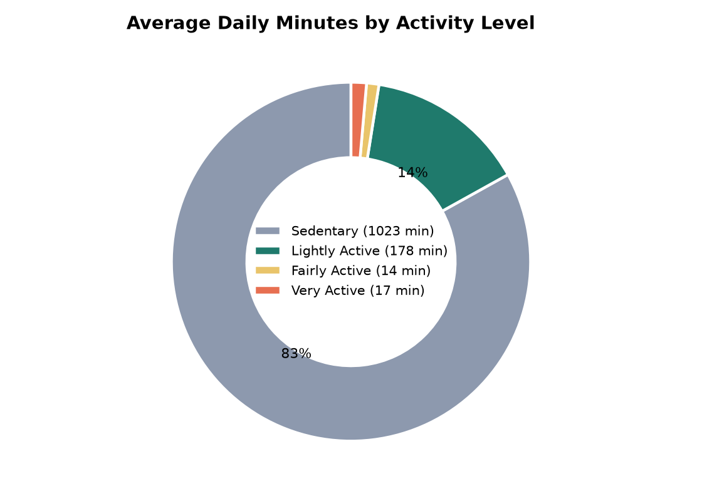
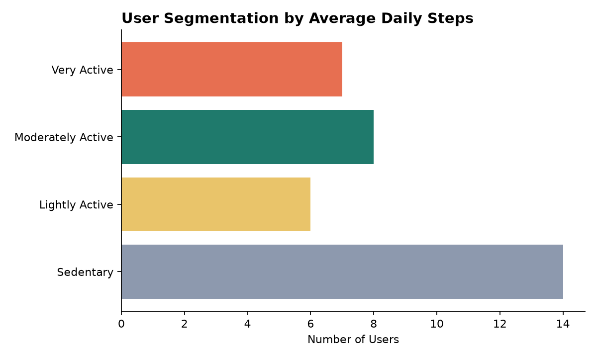
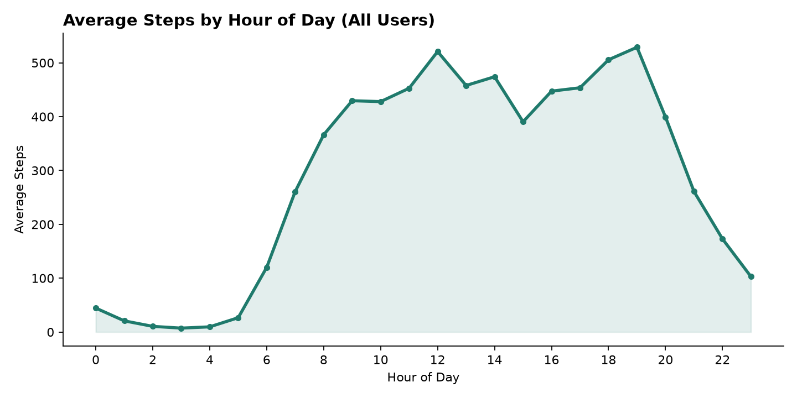
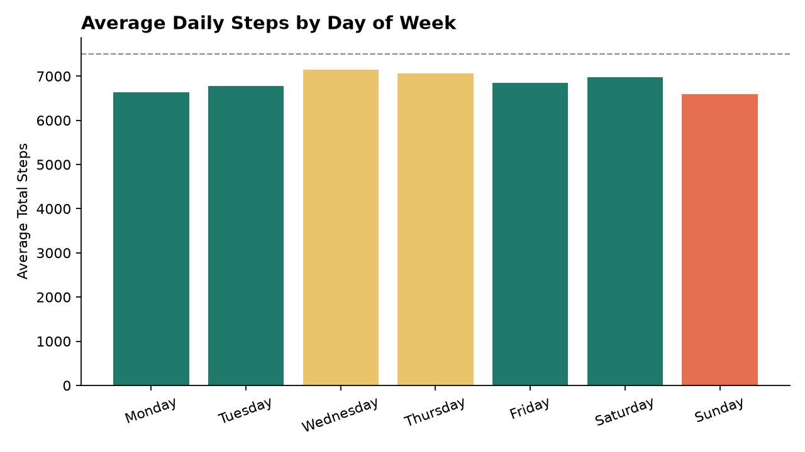
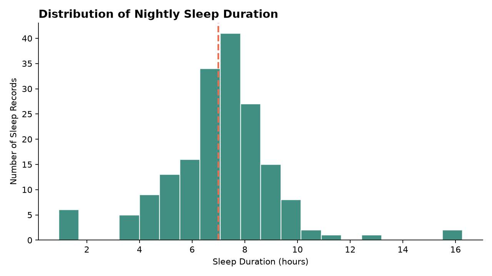
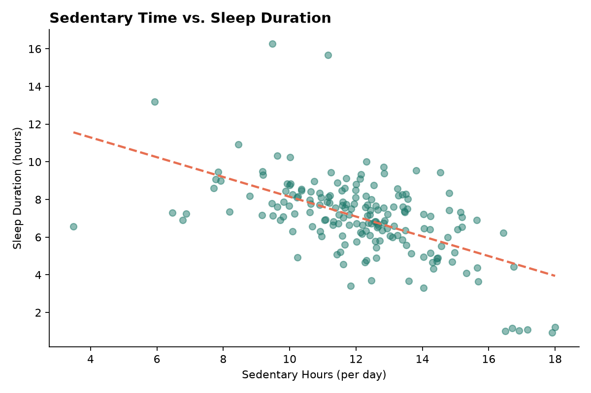
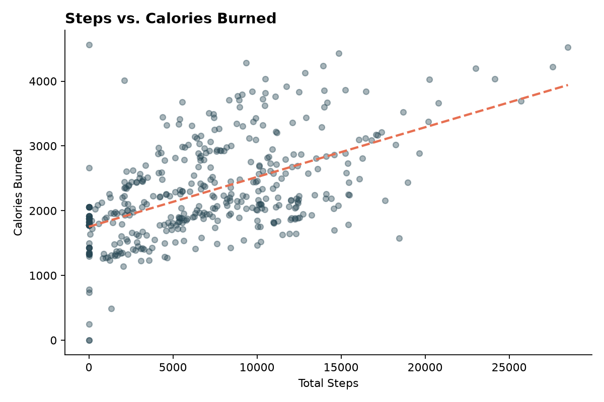
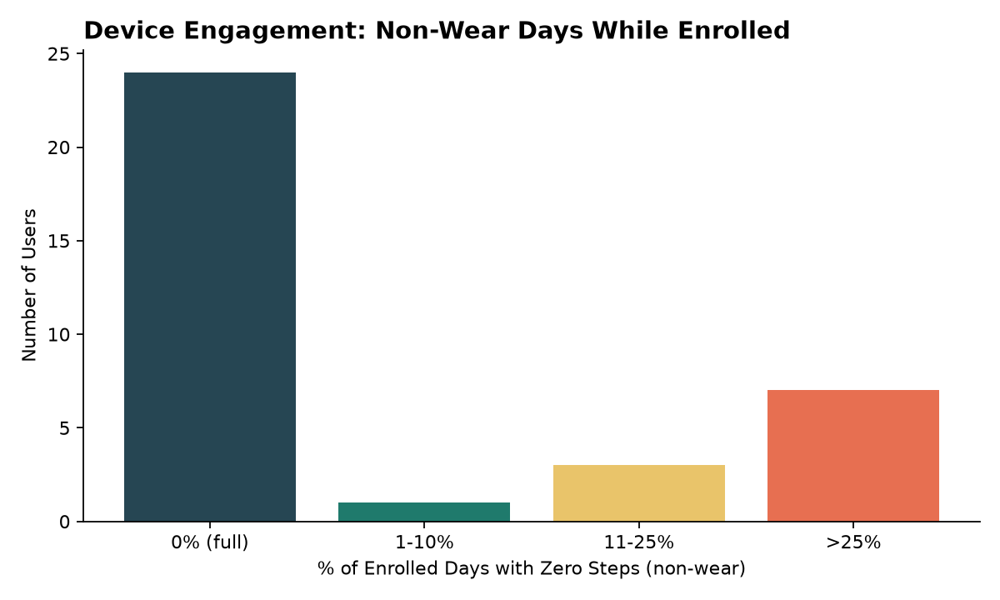

# How Can a Wellness Company Play It Smart?
### A Bellabeat Smart Device Usage Analysis: Month 1 (March 12 to April 11, 2016)
*Google Data Analytics Capstone Case Study, Rushil Negi*

This report covers the first month of the data only. It uses the same cleaning steps, charts and layout as the combined two-month report (`Bellabeat_Case_Study_Combined.md`). Comparisons to April–May below come from running the same analysis on the April 12 to May 12 export on its own.

---

## 1. Business Task

Bellabeat is a small but growing company that makes health-focused smart devices for women. Its products are the Leaf tracker, the Time watch, the Spring water bottle and the Bellabeat app. Cofounder Urška Sršen believes that smart device fitness data, even from a non-Bellabeat device, can show usage trends that help shape the marketing strategy.

Guiding questions:
1. What are some trends in smart device usage?
2. How could these trends apply to Bellabeat customers?
3. How could these trends help influence Bellabeat marketing strategy?

Stakeholders: Urška Sršen (Cofounder and CCO), Sando Mur (Cofounder) and the Bellabeat marketing analytics team.

This analysis focuses on the Leaf and Time trackers, as activity and sleep tracking are what the dataset covers best.

---

## 2. Data Source

The data is the FitBit Fitness Tracker Data (CC0: Public Domain), made available on Kaggle through Mobius. It contains anonymised fitness tracker data from Fitbit users who agreed to share minute-level output for physical activity, heart rate and sleep. This report uses the first of the two monthly exports.

| File | Contents | Rows (raw file) | Users |
|---|---|---|---|
| `dailyActivity_merged.csv` | Daily steps, distance, activity minutes, calories | 457 | 35 |
| `minuteSleep_merged.csv` | Minute-level sleep state (asleep, restless, awake) | 198,559 | 23 |
| `hourlySteps_merged.csv` | Hourly step totals | 24,084 | 34 |
| `hourlyIntensities_merged.csv` | Hourly intensity | 24,084 | 34 |
| `weightLogInfo_merged.csv` | Manual and automatic weight logs | 33 | 11 |
| `heartrate_seconds_merged.csv` | Second-level heart rate | 1,154,681 | 14 |

Date range used: March 12 to April 11, 2016 (31 days). The export runs to April 12, but that day is cut off part way through (a device sync cutoff), so it was dropped. This takes `dailyActivity_merged.csv` from 457 to 433 rows.

### Does this data ROCCC?

| Criterion | Assessment |
|---|---|
| Reliable | Limited. Only 35 users, which is below the usual sample size for population-level claims. |
| Original | Third party (Mobius). Not collected by Bellabeat or Fitbit. |
| Comprehensive | Partial. Heart rate covers 14 of 35 users (40%) and weight covers 11 of 35 (31%), so neither can be generalised. |
| Current | The data is from 2016. Wearable habits have changed a lot since then. |
| Cited | The source and licence are documented, but there are no demographics (age, location, occupation). |

The main limitation of this month is that the group of users was still growing. Only 2 users have data on March 12, 4 are enrolled by March 25 and 34 by April 1. Any daily average before April 1 comes from a small subset of the users. This does not affect April–May, where the full group is present from the first day. The March 12 to 31 period is treated with extra care below, and flagged where it could affect a headline number (see Finding 4 and Section 6).

The sample is also small, old and not representative, and the dataset does not confirm the gender of participants even though Bellabeat sells to women. The findings are directions worth testing, not proof.

---

## 3. Data Cleaning and Preparation (Process)

Tools used: Python (pandas, matplotlib) for cleaning, aggregation and charts.

1. Parsed dates and timestamps into datetime format for all files.
2. Dropped April 12 (truncated, see Section 2) and checked for duplicates. None were found in `dailyActivity_merged` (0 of 433 rows).
3. Checked for non-wear days. 56 of 433 daily records (12.9%) show 0 steps, which suggests the device was not worn. This is higher than April–May (8.2%). They were kept and flagged (see Finding 8).
4. Checked for staggered enrolment. Every user's own tracking window has no gaps, so the low engagement a fixed 32-day count would suggest is caused by users joining at different times and not by drop-out. Engagement is therefore measured as non-wear days within each user's own enrolled window.
5. Grouped the minute-level sleep data (1 = asleep, 2 = restless, 3 = awake) into sleep sessions and then into days, giving total minutes asleep, total time in bed and sleep efficiency. Each session is dated by the day it ended, so a night that crosses midnight counts once. Days with 60 minutes or less in bed were removed as naps.
6. Merged daily activity with daily sleep on Id and date. 180 of 433 activity days had matching sleep and all 180 passed the 60-minute minimum.
7. Aggregated hourly steps to look at time-of-day and day-of-week patterns.
8. Calculated user averages (steps, sedentary minutes, calories) and grouped users with the CDC step bands: under 5,000 Sedentary, 5,000 to 7,499 Lightly Active, 7,500 to 9,999 Moderately Active and 10,000 or more Very Active.

Code: [`scripts/analysis_month1.py`](../../scripts/analysis_month1.py)

---

## 4. Analysis and Key Findings

### Finding 1: Users are sedentary for most of the day
The average was about 1,023 minutes (17.1 hours) of sedentary time a day. That compares with about 178 minutes lightly active, 14 fairly active and 17 very active. April–May was a little lower at about 991 sedentary minutes.

### Finding 2: This month has more Sedentary users than April–May
Grouping the 35 users by average daily steps:
- Sedentary (under 5,000): 14 users (40%)
- Lightly Active (5,000 to 7,499): 6 users (17%)
- Moderately Active (7,500 to 9,999): 8 users (23%)
- Very Active (10,000 or more): 7 users (20%)

Average steps were about 6,812 a day. The Sedentary group is 40% of users against 24% in April–May, while the Very Active share is about the same (20% against 21%). Some of this may be a real difference and some may come from the small group in late March (see Finding 4). It is a hypothesis, not a confirmed trend.

### Finding 3: Activity peaks later in the day than in April–May
The clearest peak is in the evening at 7 PM (529 steps on average in that hour). There is a wide plateau from midday to early evening and no sharp lunchtime spike.

### Finding 4: Day of week should be read with care
Wednesday (7,143 steps) and Thursday (7,068) are the most active days and Sunday is the least active (6,595). The whole range is only about 550 steps. April–May had Saturday and Tuesday on top and Sunday lowest. Tuesday looked like the slowest day in an earlier run, but that came from the truncated April 12, which was a Tuesday, and it disappeared once that day was dropped. The early weeks are also built from a small slice of the panel (4 users enrolled by March 25 against 34 by April 1), so I would treat the day-of-week differences here as small and not rely on them.

### Finding 5: Close to half of nights are under 7 hours
Across 180 valid sleep records:
- Average sleep efficiency was 91.6%, the same as April–May (91.6%). Sleep quality once in bed is fine.
- 45.6% of nights were under 7 hours, compared with 43.9% in April–May.
- Median sleep was 7.18 hours and the mean was 7.03 hours, both just over 7.

The typical night meets the minimum but close to half of nights do not, and the share is similar in both months, which suggests the sleep gap is not a one-month effect.

### Finding 6: More sedentary time goes with less sleep in both months
The correlation between sedentary minutes and total sleep is r = -0.56 (n = 180), the same as April–May (-0.56). Steps and sleep are more weakly related (r = -0.29), so sedentary time looks like the more useful measure. This is correlation only.

### Finding 7: Steps and calories are only moderately correlated (r = 0.56)
April–May was almost the same (r = 0.59). Calorie burn depends on more than step count.

### Finding 8: Most users wore the device on every enrolled day
Non-wear is measured as days with zero steps as a share of each user's own enrolled days. A fixed 32-day count would be misleading here (see Section 3).
- 24 of 35 users (69%) had no zero-step days.
- 1 user (3%) had zero-step days on 1 to 10% of their enrolled days.
- 3 users (9%) were in the 11 to 25% range.
- 7 users (20%) had zero-step days on more than a quarter of their enrolled days. One user had zero steps on all 8 of their logged days.

Zero-step days were 12.9% of records this month against 8.2% in April–May.

### Finding 9: Heart rate and weight have much lower adoption
14 of 35 users (40%) have heart rate data and 11 of 35 (31%) logged weight. Heart rate is about the same as April–May (42%) and weight is higher (24%), but both are far below basic activity tracking.

---

## 5. Recommendations for Bellabeat Marketing Strategy

The sleep gap and the sedentary and sleep link appear in both months, so these recommendations match the combined report.

1. Lead with sleep as well as steps. About 44 to 46% of nights fall short of 7 hours in both months. It is the most consistent hook in the data.
2. Test notification timing for each group of users. This month peaked in the evening around 7 PM with no clear lunchtime spike, which is different from April–May. A fixed notification schedule should be checked against each season or group.
3. Set onboarding by activity tier. This month was 40% Sedentary against 24% in April–May. A single default step goal would suit fewer users here. Goals based on each user's own baseline are safer than a fixed 10,000 steps.
4. Build the sedentary and sleep link into the product, and add re-engagement prompts for the 1 in 5 users with high non-wear.
5. Re-run the day-of-week and activity-level comparisons on the April-only data before using them. These are the results most affected by the small group in late March.

---

## 6. Limitations and Next Steps

- This is a small (35 users), 2016, gender-unconfirmed sample from a competitor's product. It is not Bellabeat data, so the findings are hypotheses to test.
- This month has a staggered-enrolment problem that April–May does not. Only 2 users have data on March 12 and 4 by March 25, and the panel does not reach full size until April 1. Any figure that depends on those early days, day of week especially, should be checked on the April-only data.
- Heart rate and weight are too sparse for reliable conclusions.
- The combined two-month report covers the next step, which is putting both months into one 62-day panel for steadier estimates.

---

*Data: [FitBit Fitness Tracker Data](https://www.kaggle.com/datasets/arashnic/fitbit), CC0: Public Domain, via Mobius. Analysis and charts by Rushil Negi for the Google Data Analytics Certificate capstone.*
